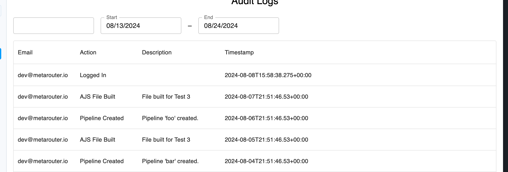

### Quick start

```
$ npm install
```

```
$ npm run start 
```

### Objectives

#### 1. Add MUI's DateTimeRangePicker to filter Audit Logs


### 2. Refactor
There's a lot of tech debt at MR. The code in this example
was built in a similarly messy way. How would you clean things up? 

